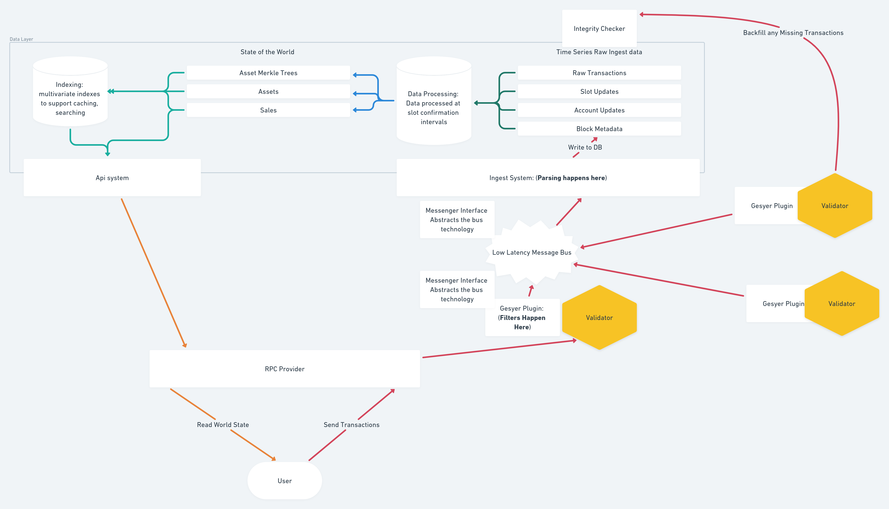

# Read Api

The Digital Asset Read API is a distributed system that serves cached and aggregated Digital Asset content from the Solana Blockchain. This technology stack is meant to run on many RPC providers just as the Solana Blockchain data can be served from many RPC providers. It is made up of the following components.

- Read Only Digital Asset RPC API
- Geyser Plugin
- Transaction and Account Ingest
- Background Integrity checker

Here is a diagram of the component parts working together:

# Contributing
The specification for the api is located at `./openrpc_spec.json` and the query language specification is located at  [MQL](./mql.md)
